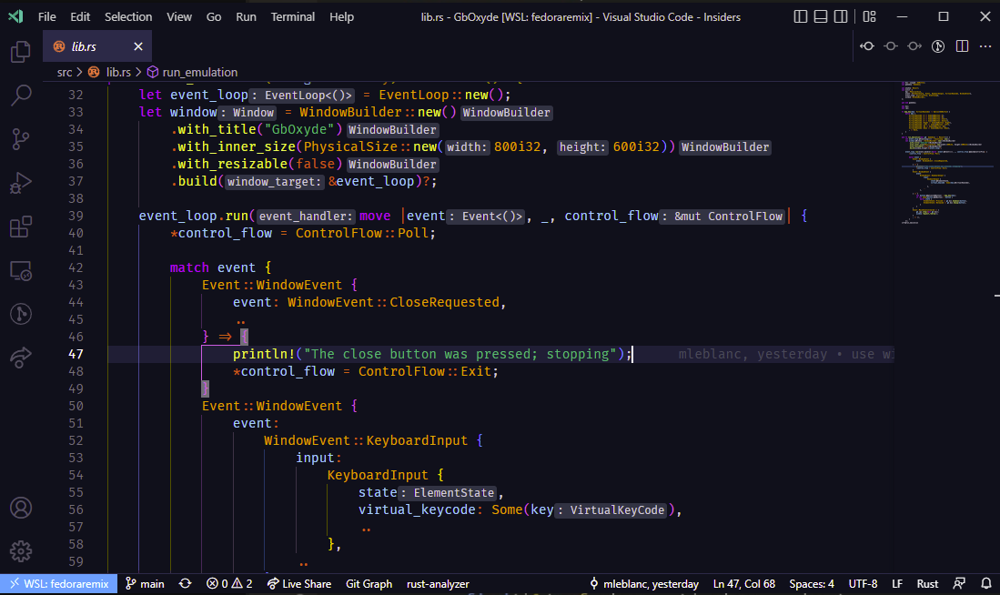

<h1 align="center">🌌 Ocean Space Refined 🚀</h1>

<h1 align="center">

</h1>

<h4 align="center">
 Edit of <a href="https://github.com/oscarmcm/ocean-space">Ocean Space</a>, the deep oceanic blue Visual Studio Code theme
</h4>

## Rust

## C++

> **NOTE**: This theme includes a variant with italic keywords that looks great with fonts like Operator Mono or Catograph Mono

## Special thanks

Thanks to [Oscar Cortez](https://github.com/oscarmcm) for his [Ocean Space](https://github.com/oscarmcm/ocean-space) theme, which this theme is forked from.

## License

[MIT](LICENSE)
